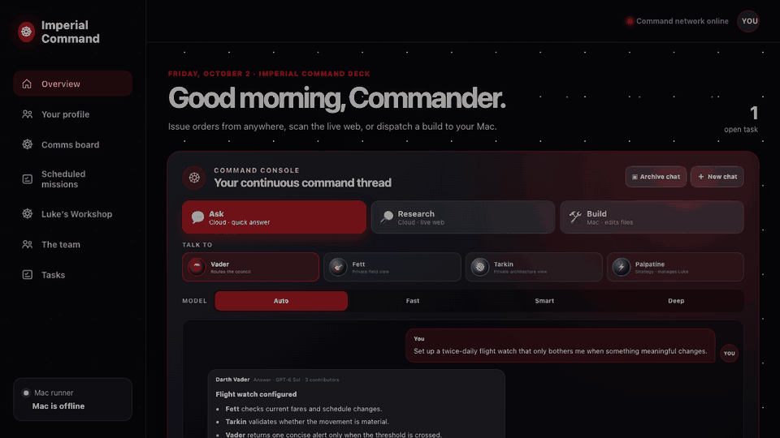

# Agent Office

**A private, mobile-first AI team on Cloudflare, with visible collaboration and an optional guarded local runner.**

[](https://developers.cloudflare.com/workers/)
[](https://react.dev/)
[](https://www.typescriptlang.org/)
[](LICENSE)

Agent Office turns a private AI chat into a small operating system for ongoing work. A Cloudflare Worker keeps the office available from a phone, D1 holds auditable state, Vectorize recalls useful preferences without retaining every raw conversation, and an optional Python runner performs approved build work on your own computer.



*A 15-second walkthrough using synthetic demo data—no private tasks, conversations, or profile information.*

The included interface is an unofficial, fan-themed example called **Imperial Command**. Replace the names, voices, and theme with your own cast. No third-party character artwork is distributed in this repository, and the project is not affiliated with or endorsed by Lucasfilm or Disney.

## Why this is different

Most AI chats hide orchestration behind one answer and forget how work happened. Agent Office makes the operating model visible:

| Capability | What it changes |
| --- | --- |
| Visible council routing | You can see who was assigned, why, what each specialist contributed, and when work returned. |
| Cloud plus local execution | Q&A, research, schedules, and memory remain online while your computer sleeps; approved builds wait safely for the runner. |
| Bounded research | Leases, time limits, retries, and recovery checks prevent “researching forever.” |
| Continuous private conversations | Keep a thread with the manager or open a private audience with a specialist. |
| Evolving owner memory | Nightly distillation turns useful preferences into editable knowledge nodes and vector search—not a permanent dump of raw chat. |
| Human-gated improvement loop | A rotating intern proposes small improvements, a senior reviews them, and build and deploy require separate approval. |
| Cost-aware personality | Deterministic handoffs are free; model calls are reserved for answers, planning, reviews, and selected social moments. |
| Explicit retention | Daily operational chatter clears automatically; intentional archives remain until you delete them. |

## The small architecture

```text
iPhone / browser / installed PWA
              |
      Cloudflare Access
              |
  React UI + Worker API
       /       |       \
     D1    Workers AI  Vectorize
      |        |
 schedules  AI Gateway
      |
 optional email alerts

              |
      outbound polling only
              |
  optional Python runner
   Codex CLI or Ollama
```

There is no Docker, Redis, Kubernetes, separate API server, or always-on home machine.

## What is included

- Mobile-first React dashboard and Cloudflare Worker API.
- Five themed roles: manager, researcher, architect, strategist/mentor, and rotating engineering intern.
- Cost-aware Fast, Smart, Deep, and automatic model routing.
- One-off Q&A, live-web research, and guarded local build tasks.
- Daily or twice-daily scheduled missions with visible recruitment and email completion alerts.
- Continuous chat with separate private specialist audiences.
- D1 knowledge graph plus Vectorize semantic recall.
- Daily cleanup, memory distillation, sprint reviews, 1:1s, and evidence-based fortnightly reviews.
- A social watercooler with continuity, duplicate suppression, current-event context, and deterministic fallbacks.
- A two-stage, human-approved workshop for small product improvements.
- A standard-library Python runner with a narrow workspace and deployment guardrails.

The detailed behavior and design rationale live in [docs/ARCHITECTURE.md](docs/ARCHITECTURE.md).

## Quick start

### 1. Prerequisites

- Node.js 22 or newer and npm.
- Python 3.11 or newer for the optional local runner.
- A Cloudflare account with Workers, D1, Workers AI, Vectorize, and AI Gateway available.
- Optional: a [Resend](https://resend.com/) account for email alerts.
- Optional: Codex CLI or [Ollama](https://ollama.com/) for local build execution.

Clone the repository and install the two JavaScript dependencies:

```bash
git clone https://github.com/Showndarya/agent-office.git
cd agent-office
npm install
npx wrangler login
```

### 2. Create the Cloudflare resources

Create D1 and copy the returned database ID into `wrangler.jsonc`:

```bash
npx wrangler d1 create agent-office-db
```

Create the 768-dimension Vectorize index used by the bundled BGE embedding model:

```bash
npx wrangler vectorize create agent-office-memory --dimensions=768 --metric=cosine
```

In Cloudflare, create an AI Gateway named `agent-office`. Configure the model providers or Unified Billing you want to use. The code sends `store: false` and disables per-request gateway logging; for a private deployment, also review the Gateway's account-level logging and data-retention settings.

The reference router uses `openai/gpt-6-luna`, `openai/gpt-6-sol`, and `openai/gpt-6-astra`, with Cloudflare-hosted Qwen fallbacks and social calls. Model availability and billing vary by account, so update the `routes` map in `worker/index.ts` if your Gateway exposes different models.

### 3. Initialize D1

Apply every numbered migration to the remote database:

```bash
npm run db:migrate:remote
```

The public seed starts with a deliberately sparse owner profile. Your preferences are learned from later conversations instead of being copied from this repository.

### 4. Add the runner secret

Create a long random value, then enter it when Wrangler prompts:

```bash
npx wrangler secret put RUNNER_TOKEN
```

Use the same value later as `AGENT_OFFICE_RUNNER_TOKEN` in `runner/.env`. The runner is optional, but leaving the Worker secret configured avoids accidental unauthenticated runner routes.

For email notifications, optionally add:

```bash
npx wrangler secret put RESEND_API_KEY
```

Then set these ordinary Worker variables in the Cloudflare dashboard if needed:

- `APP_URL`: the final dashboard URL, including `https://`.
- `NOTIFY_FROM_EMAIL`: a sender on a domain you verified with Resend.
- `AI_GATEWAY_ID`: only needed if you did not name the Gateway `agent-office`.

### 5. Deploy and protect it

```bash
npm run deploy
```

Immediately place the Worker behind **Cloudflare Access** and use an Allow policy limited to your email addresses. Treat this as required: the app contains personal conversations, schedules, and a route used by the local runner.

In the current Cloudflare dashboard, open the Worker and enable Access for production traffic, or create a hostname-based self-hosted Access application for its `workers.dev` or custom hostname. Create a service token for the runner and keep its client ID and secret only in `runner/.env`.

Cloudflare setup references:

- [D1 Wrangler commands](https://developers.cloudflare.com/d1/wrangler-commands/)
- [Create a Vectorize index](https://developers.cloudflare.com/vectorize/best-practices/create-indexes/)
- [Protect a Worker with Cloudflare Access](https://developers.cloudflare.com/workers/configuration/cloudflare-access/)
- [Deploy a Worker with static assets](https://developers.cloudflare.com/workers/static-assets/get-started/)

## Safe local development

The shipped configuration mirrors the original private installation and sets the D1 binding to `remote: true`. Therefore `npm run dev` can touch your remote D1 data.

For an isolated local D1 mirror, use:

```bash
npm run db:migrate:local
npm run dev:local
```

Before changing retention, migrations, authentication, or the runner protocol, test against the local mirror and run:

```bash
npm run build
npm run lint
python3 -m py_compile runner/runner.py
```

## Optional local runner

The cloud office works without the runner. Build orders remain queued until an approved runner comes online.

1. Copy `runner/.env.example` to `runner/.env`.
2. Fill in the Worker URL, the runner token, Cloudflare Access service-token values, and an absolute workspace path.
3. Run one polling cycle before enabling a background service.

macOS or Linux:

```bash
AGENT_OFFICE_RUN_ONCE=1 runner/run.sh
```

On macOS, `runner/install.sh` installs the included LaunchAgent. On Windows, the Python runner reads `runner/.env` directly:

```powershell
$env:AGENT_OFFICE_RUN_ONCE = "1"
py runner\runner.py
```

After the one-shot test succeeds, run it at login with Task Scheduler or your preferred service manager. The bundled installer is macOS-only; the runner core is standard-library Python and works on macOS, Windows, and Linux.

Build execution defaults to Codex. To use Ollama instead:

```dotenv
AGENT_OFFICE_PROVIDER=ollama
AGENT_OFFICE_LOCAL_MODEL=your-installed-model
```

The runner can write only inside the configured workspace. The automated workshop lane additionally blocks secrets, authentication, billing, migrations, dependencies, runner code, Wrangler configuration, purchases, and external messages. Build and deployment are separate approvals.

## Privacy and retention

This is application behavior, not a promise about provider backups or legal retention. Review the current policies of Cloudflare, your chosen model provider, Resend, and any local model tooling.

| Data | Default application behavior |
| --- | --- |
| Active command chat | Kept during the day; distilled at the nightly boundary and then deleted unless intentionally archived. |
| Archived chat | Distilled but retained until the owner uses Delete archive. |
| Handoffs and watercooler | Cleared at the next Eastern-time daily cleanup. |
| Task results and schedules | Persist in D1 for operational history. |
| Sprint and leadership reviews | Persist in D1. |
| Owner profile and knowledge graph | Persist as editable distilled claims with confidence and evidence counts. |
| Vectorize data | Stores embeddings and node metadata for active knowledge—not raw chat transcripts. |
| Local build output | Remains in local Git history and the configured workspace according to normal Git behavior. |

The Worker requests `store: false`, disables request logging at AI Gateway calls, and bounds research. Still configure provider-level zero-retention controls where available, protect the Worker with Access, rotate leaked secrets, and never commit `runner/.env`.

## Cost controls

The architecture is intentionally small, but it is not free by definition. The meaningful cost drivers are model calls, Workers AI usage, Vectorize, email, and high request volume—not deterministic handoff messages.

Built-in controls include:

- One bounded answer call instead of one expensive call per visible agent.
- Qwen for economical planning and social messages, with deterministic fallbacks.
- A single minute cron that multiplexes recovery, schedules, cleanup, reviews, and social timing.
- Uniqueness keys that prevent duplicate scheduled runs.
- Two workshop proposals per week, each requiring human approval.
- No auto-top-up or purchasing logic in the application.

For a quieter deployment, reduce or disable watercooler generation and scheduled reviews in `worker/index.ts`. Always check [Cloudflare's current pricing](https://www.cloudflare.com/plans/developer-platform/) and your model provider's current rates before enabling frequent automations.

## Make it yours

The Star Wars-inspired office is only one skin. For a fresh database, customize these before applying migrations:

- `migrations/0003_imperial_theme.sql`: names, roles, personalities, and quirks.
- `worker/index.ts`: agent voices, routing rules, model names, and recurring behavior.
- `src/App.tsx`: visible labels and organization chart.
- `src/App.css` and `src/index.css`: colors, typography, and atmosphere.
- `public/agents/`: optional artwork that you own or are allowed to redistribute.

Keep the stable internal IDs (`atlas`, `scout`, `pixel`, `muse`, and `luke`) unless you also update every migration and API assumption. For an existing database, add a new numbered migration instead of editing one that has already run.

## API surface

The main routes are documented in [docs/ARCHITECTURE.md](docs/ARCHITECTURE.md). Runner routes live under `/api/runner/*` and require the shared bearer token; Cloudflare Access should protect the entire deployment as the outer identity layer.

## Contributing

Small, auditable improvements are welcome. Read [CONTRIBUTING.md](CONTRIBUTING.md) and [SECURITY.md](SECURITY.md) first. Please do not submit copyrighted character artwork, credentials, private transcripts, database exports, or personal profile seeds.

## Project history and credit

The repository preserves the six development milestones that produced the working private deployment, followed by a dedicated public-release hardening commit.

Created by **Showndarya** and developed collaboratively with **OpenAI Codex**. AI assistance is disclosed plainly because the interesting part is not pretending one person typed every line—it is making the decisions, safeguards, and evolution inspectable.

Code is available under the [MIT License](LICENSE). Character names and third-party trademarks belong to their respective owners and are not covered by that license.
